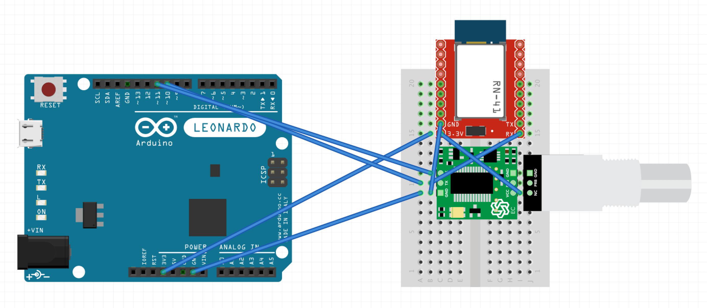
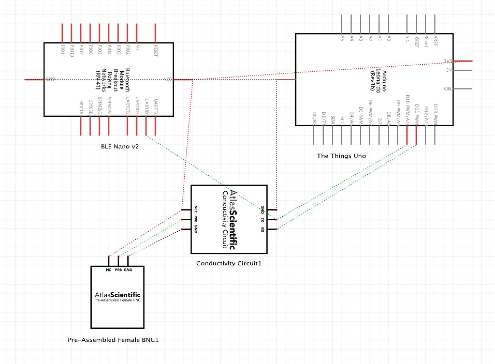

# RedBear Nano v2

Arduino code for a RedBear Nano v2 to allow it to send serial messages from external sensors to an iOS device via Bluetooth BLE.

## Software & Hardware

Read more about the [RedBear BLE Nano v2](https://redbear.cc/product/ble-nano-2.html).

They have a good [GitHub repo for getting started](https://github.com/redbear/nRF5x/tree/master/nRF52832).

Including a guide for installing the [boards library](https://github.com/redbear/nRF5x/blob/master/nRF52832/docs/Arduino_Board_Package_Installation_Guide.md) in Arduino.

## Example wiring diagram

Here's how I wired it in for a [Water Quality sensors project](https://github.com/sighmon/water-quality-sensors).

## iOS app

See the accompanying iOS app repo:
https://github.com/sighmon/WaterQualitySensorsiOS

